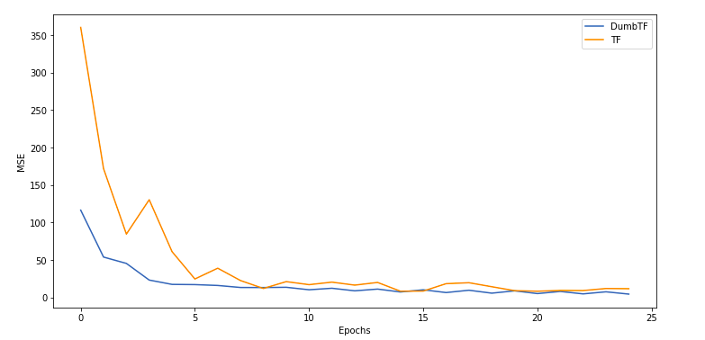
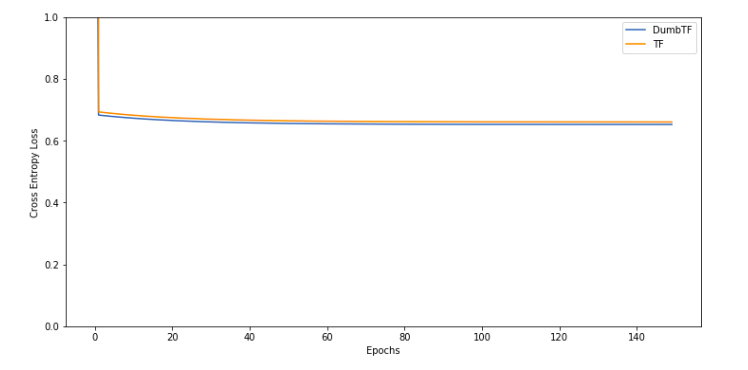
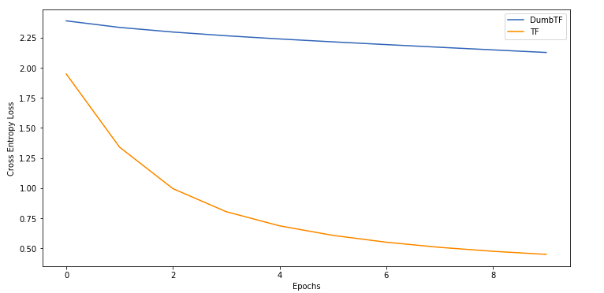
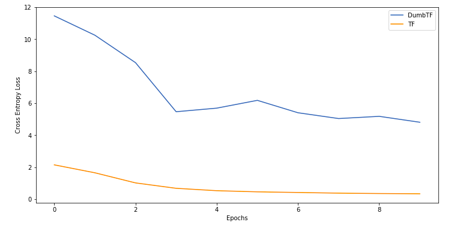

<p align=center></p>

# DumbTF
---
A deep learning library for dumb people. 

## Focus
---
- Implement additional layers, to be used along with convolutions
- Convolutions are still slow, despite using the numpy stride trick and einsum.

## Installation
`pip install Dumb-TF`

Doesn't work though. Have patience. Was just learning to make packages.

## Status 
---
- ### Regression (Boston Housing Dataset)
    Network Architecture
    ```python
    model = Model()
    model.add(Dense(128, input_shape=13, activation='relu'))
    model.add(Dense(64, input_shape=128, activation='relu'))
    model.add(Dense(1, input_shape=64, activation='linear'))

    model.compile(loss="mse", optimizer="mini_batch_gd", lr=0.01)

    loss, loss_pe = model.fit(x_train, y_train, epochs=20, batch_size=64)
    ```
    

- ### Binary Classification (Breast Cancer Dataset)
    Network Architecture
    ```python
    model = Model()
    model.add(Dense(64, input_shape=30, activation='relu'))
    model.add(Dense(32, input_shape=64, activation='relu'))
    model.add(Dense(1, input_shape=32, activation='sigmoid'))

    model.compile(loss="bce", optimizer="mini_batch_gd", lr=0.01)

    loss, loss_pe = model.fit(x, y, epochs=150, batch_size=64)
    ```
    

- ### Multiclass Classification (MNIST)
    Network Architecture
    ```python
    model = Model()
    model.add(Dense(32, input_shape=784, activation='relu'))
    model.add(Dense(10, input_shape=32, activation='softmax'))

    model.compile(loss="cce", optimizer="mini_batch_gd", lr=0.01)

    loss, loss_pe = model.fit(x_train, y_train, epochs=10, batch_size=64)
    ```
    

- ### Convolution Network (MNIST)
    Network Architecture
    ```python
    model = Model()
    model.add(Conv2D(32, 3, 'relu', (28, 28, 1)))
    model.add(Conv2D(32, 3, 'relu', (26, 26, 32)))
    model.add(Flatten())
    model.add(Dense(10, input_shape=26*26*32, activation='softmax'))

    model.compile(loss='cce', optimizer='mini_batch_gd')

    loss, loss_pe = model.fit(x_train, y_train, epochs=10, batch_size=64)
    ```
    

## References
- http://neuralnetworksanddeeplearning.com/chap2.html
- https://brilliant.org/wiki/backpropagation/#$
- https://towardsdatascience.com/batch-mini-batch-stochastic-gradient-descent-
- https://www.youtube.com/watch?v=i94OvYb6noo

### For Convolutions
* https://www.sicara.ai/blog/2019-10-31-convolutional-layer-convolution-kernel
* https://towardsdatascience.com/beginners-guide-to-understanding-convolutional-neural-networks-ae9ed58bb17d
* https://www.youtube.com/watch?v=8rrHTtUzyZA

(FAST CONVOLUTIONS)
* https://laurentperrinet.github.io/sciblog/posts/2017-09-20-the-fastest-2d-convolution-in-the-world.html
* https://towardsdatascience.com/how-are-convolutions-actually-performed-under-the-hood-226523ce7fbf
* https://jessicastringham.net/2017/12/31/stride-tricks/

(Backpropagation in convolutions)
* https://medium.com/@pavisj/convolutions-and-backpropagations-46026a8f5d2c
* https://www.jefkine.com/general/2016/09/05/backpropagation-in-convolutional-neural-networks/

(MaxPool2D)
* https://wiseodd.github.io/techblog/2016/07/18/convnet-maxpool-layer/#:~:text=Maxpool%20backward&text=We%20let%20the%20gradient%20pass,max%20operation%20do%20in%20backpropagation.