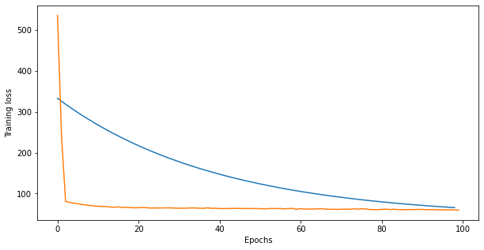

# DumbTF
---
A deep learning library for dumb people. 

## Focus
---
- Current focus is to create a dense network, to train MNIST.
- I was wrong. It's better to work on a regression problem first, because
  of the simple loss function.

## Installation
`pip install Dumb-TF`

Doesn't work though. Have patience. Was just learning to make packages.

## Status 
---
* It's so good to see the loss going down for boston housing regression. :)
* Keras vs DumbTF on boston housing. (Orange is keras)

</img>

## References
- http://neuralnetworksanddeeplearning.com/chap2.html
- https://brilliant.org/wiki/backpropagation/#$
- https://towardsdatascience.com/batch-mini-batch-stochastic-gradient-descent-7a62ecba642a